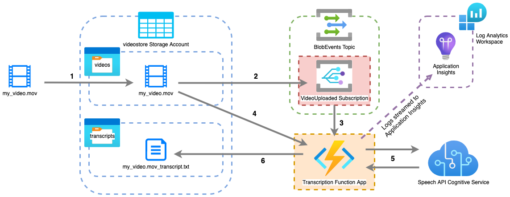

# Transcript App – Terraform Configuration

## Contents

## Overview



The Terraform configuration in this repository will provision all of the above infrastructure **except the following**:

- While the Function App itself is provisioned, the function is not. It's unclear as to why, but Terraform appears to be unable to upload the code for the function successfully, so this part has been ommitted. The function must be deployed manually – instructions are included in the README in the function repo's code.
- The *VideoUploaded* Event Grid Subscription requires the function to exist before it is created so that it can be associated with the function's endpoint. As a result, it must be created manually – instructions to do this are also included in the function repo's README.

## Deployment

To deploy the infrastructure, clone the repository and switch to the directory on the command line. Then, run:

```bash
terraform apply
```

By default, the infrastructure will be provisioned within the East US region and all resources are prefixed with `transcript-app`. 

You can modify the project name (which every resource's name is prefixed with) and the deployment region with the variables `project_name` and `location`, respectively. This can be done by running:

```bash
export TF_VAR_project_name=<YOUR_PROJECT_NAME> TF_VAR_location=<YOUR_LOCATION>
```

Alternatively, you can create a `.tfvars` or `.auto.tfvars` file with the following contents to override the default values:

```hcl
project_name = <YOUR_PROJECT_NAME>
location = <YOUR_LOCATION>
```

And run `terraform apply -var-file="variables.tfvars"` (`.auto.tfvars` will be detected by default).

## Improvements

- Secrets such as keys and endpoints are currently passed between resources and saved as application configuration values in the Function App, which is not best practice. Saving keys in Key Vault and having the function retrieve them would be an improvement. May require creation of a service identity.
